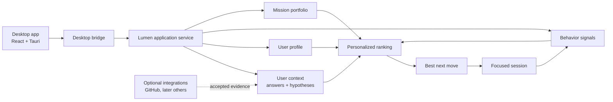

# Lumen

> A personal desktop assistant that learns what actually matters to you, turns that context into useful next actions, and gets more accurate as you use it.

Lumen is being built for people who do not want another task manager, another dashboard to configure, or a terminal full of commands.

The product goal is simple:

> Open Lumen and get a useful answer to: **“What should I actually do next, given my goals, my current situation, and how I really behave?”**

The desktop app is the primary product. The CLI remains available for development, testing, and power users, but it is not the intended user experience.

## What using Lumen feels like

A new install starts with a short conversation instead of a settings form.

```text
What should I call you?
↓
What is taking most of your attention right now?
↓
What would you most like to be different a month from now?
↓
What usually gets in the way?          optional
↓
How much focused time feels realistic?
```

Lumen turns those answers into a starting understanding of the person and immediately creates a first set of personalized missions.

That first understanding is **not treated as permanent truth**. It is stored as a set of hypotheses with confidence and is updated from real usage.

```text
first conversation
      ↓
starting hypotheses
      ↓
personalized missions
      ↓
what the user starts, finishes, postpones or rejects
      ↓
updated understanding
      ↓
better next recommendation
```

The goal is for two people using the same application to gradually get genuinely different experiences.

## Personalization without a manual

Lumen deliberately avoids exposing tuning controls such as priority weights, risk scores, or ranking coefficients to normal users.

Instead, the app learns from lightweight actions:

- **More like this** strengthens a preference;
- **Less like this** weakens it;
- **Not now** means timing is wrong, not that the underlying goal is unwanted;
- completing meaningful work is a positive signal automatically;
- repeated conflicting behavior can trigger one short clarification question instead of a silent guess.

For example, if Lumen keeps suggesting 60-minute sessions and the user repeatedly postpones them, it can ask whether smaller steps would help and reduce the focus window automatically.

## What the desktop app already has

The current desktop application is built with React + Tauri on top of the Python Lumen engine.

It currently includes:

- conversational first-run onboarding;
- isolated local state per user;
- personalized mission ranking;
- a daily “best next move”;
- focused work sessions with progress;
- low-friction preference feedback;
- adaptive hypotheses with confidence;
- clarification prompts when behavior contradicts the current model;
- opt-in public GitHub context with preview-before-save;
- refresh and disconnect controls for GitHub-derived context;
- Activity and Profile views;
- persistence across application restarts;
- a standalone packaged engine for Windows;
- an NSIS Windows installer build that requires no Python or development tooling on the end-user machine.

The desktop shell, frontend build, Python bridge, Tauri host, standalone engine smoke test, and Windows installer build are covered by CI.

### Windows install

Lumen now produces a normal Windows setup executable:

```text
Lumen_0.1.3_x64-setup.exe
```

The user path is:

```text
Download Lumen
→ Run the setup executable
→ Open Lumen from Windows
→ 1–2 minute introduction
→ Start using it
```

Python, Node.js, Rust, Git, PowerShell, and a virtual environment are not required on the user's machine. The Python Lumen engine is packaged as a standalone executable and bundled into the Tauri application.

The CI-built installer is available as a **Windows Installer** workflow artifact. Tagged versions (`v*`) are configured to publish the generated setup executable to GitHub Releases automatically. Release tags must exactly match the desktop version before publication is allowed.

Development installers are currently unsigned, so Windows SmartScreen may show a publisher/reputation warning until production code signing is added.

See [Windows installation](docs/windows-installation.md), [Desktop application](docs/desktop-app.md), and [Desktop release versioning](docs/release-versioning.md).

## Optional context connections

GitHub is Lumen's first implemented external context source.

The current version deliberately starts small and safe: a user can enter a GitHub username, preview the public context Lumen found, and explicitly choose **Use this context** before anything is saved. No GitHub token is required or stored for this public-data flow.

```text
Profile → Connections
→ enter GitHub username
→ Preview
→ inspect repositories and language signals
→ Use this context
```

Once confirmed, GitHub activity becomes low-confidence evidence beside the user's own answers. It can help Lumen notice an active project or common language, but it does not silently overwrite what the user explicitly said.

The user can refresh the snapshot or disconnect GitHub at any time. Disconnecting also removes GitHub-derived hypotheses from the local context model.

Authenticated browser authorization for optional private-repository context is a later layer. It should not require personal-access-token copy/paste or CLI setup.

Connections remain optional. Lumen must stay useful without connecting an external account.

See [GitHub user context](docs/github-user-context.md).

## Privacy and trust model

Personalization only works if the user can trust what is happening.

Lumen therefore follows a few product rules:

1. **Each user has isolated state.** One person's profile, progress, and feedback are never used as another person's defaults.
2. **The first conversation is a hypothesis, not a permanent profile.** Behavior can revise it.
3. **External services are opt-in.** Lumen explains what a connection contributes before saving it.
4. **Local state is the default.** Personal runtime data lives outside repository-owned experiment state.
5. **Recommendations are explainable.** The system keeps the evidence used to rank work.
6. **Models are not authority.** Optional LLM components may help interpret or generate suggestions, but validated product state remains the source of truth.
7. **No hidden dependency on ChatGPT memory.** A fresh Lumen installation must work for a person the project has never seen before.

A local user workspace lives under:

```text
.lumen/users/<user-id>/
```

Typical state includes the user's profile, onboarding context, missions, progress, feedback, and accepted integration evidence. The `.lumen/` runtime directory is ignored by Git.

See [Personalization](docs/personalization.md) and [Profiles](docs/profiles.md).

## How Lumen decides what to show

Lumen separates evidence that is easy to accidentally mix together:

```text
what the user explicitly told us
          +
what their behavior suggests
          +
optional accepted external evidence
          +
what candidate work is currently available
          ↓
ranked recommendation
```

The ranking engine is deterministic and inspectable. Feedback can shift the ranking, but normal usage does not silently rewrite the entire profile after one click.

This is especially important for signals like **Not now**. Postponing a task is evidence about timing, not necessarily evidence that the user no longer cares about the goal.

See [Mission Radar](docs/mission-radar.md), [Ranking](docs/ranking.md), and [Work sessions](docs/work-sessions.md).

## Architecture



The GUI is intentionally thin. Core identity, personalization, ranking, progress, and state rules live behind `LumenApplication` so the product does not develop a second, contradictory personalization model in the frontend.

See [Application service](docs/application-service.md) and [Architecture](docs/architecture.md).

## Repository structure

```text
lumen-lab/
├── apps/desktop/             React + Tauri desktop application
├── packaging/                standalone desktop-engine packaging entry point
├── src/lumen_lab/            personalization and application engine
├── docs/                     architecture and deeper technical documentation
├── tests/                    product and safety behavior contracts
├── state/                    repository-owned R&D evidence
└── .lumen/users/             machine-local user data at runtime
```

`state/` and `.lumen/users/` are deliberately different things:

- `state/` describes experiments used to develop Lumen itself;
- `.lumen/users/` contains a real person's local product state.

Installing Lumen must never make a new user inherit the repository owner's profile or history.

## Running the desktop app from source

This section is only for contributors. Normal Windows users should install the packaged application instead.

Requirements for source development:

- Python 3.11+
- Node.js
- Rust toolchain required by Tauri

Install the Python project:

```powershell
python -m venv .venv
.\.venv\Scripts\Activate.ps1
python -m pip install -e ".[dev]"
```

Install the desktop frontend and launch the development application:

```powershell
cd apps\desktop
npm install
npm run tauri dev
```

The packaged Windows build uses a standalone `lumen-engine.exe`; the source-development flow intentionally keeps the simpler Python interpreter path for debugging.

## Development

Run the Python checks:

```powershell
python -m pip install -e ".[dev]"
ruff check .
pytest
lumen-doctor
```

Desktop checks live in the dedicated Desktop CI workflow and validate both the frontend build and the Tauri host.

The Windows Installer workflow builds the standalone engine with PyInstaller, smoke-tests it without a Python interpreter dependency, generates the Tauri icon set, builds the NSIS setup executable, and uploads the resulting installer artifact.

GitHub Actions also runs the Python test/lint matrix on Python 3.11, 3.12, and 3.13.

## CLI for contributors and power users

The CLI is useful for inspecting the engine, writing tests, debugging state, and working on Lumen's repository laboratory. It is not the expected onboarding path for normal users.

Installed commands:

| Command | Purpose |
| --- | --- |
| `lumen` | Repository-lab lifecycle, planning, replenishment, sandbox and optional advice. |
| `lumen-user` | Inspect and manage isolated local user workspaces. |
| `lumen-radar` | Inspect personalized mission ranking. |
| `lumen-work` | Inspect or record focused work-session progress. |
| `lumen-propose` | Generate and review bounded experiment proposals. |
| `lumen-dashboard` | Inspect the application-service payload. |
| `lumen-calibrate` | Inspect planner residual calibration. |
| `lumen-rankcheck` | Inspect ranking quality. |
| `lumen-intercept` | Evaluate an advisory calibration intercept. |
| `lumen-holdout` | Evaluate the frozen calibration baseline. |
| `lumen-synthesize` | Preview or write repository synthesis. |
| `lumen-capabilities` | Inspect named capability manifests. |
| `lumen-doctor` | Validate repository state integrity. |
| `lumen-provenance` | Inspect completed-experiment evidence links. |
| `lumen-schema` | Inspect or migrate repository state schema metadata. |

All console entry points are declared in `pyproject.toml`, and CI checks that this README does not silently drift away from them.

## Repository laboratory

Lumen also uses its own repository as a controlled R&D loop. This is an engineering layer, not the user product.

The lab contains deterministic planning, experiment outcomes, calibration, provenance, synthesis, state integrity checks, bounded subprocess execution, and GitHub issue tooling.

Useful deeper references:

- [Proposal generation](docs/proposals.md)
- [Calibration](docs/calibration.md)
- [Intercept calibration](docs/intercept_calibration.md)
- [Frozen holdout](docs/frozen_calibration_holdout.md)
- [Synthesis](docs/synthesis.md)
- [Provenance](docs/provenance.md)
- [State doctor](docs/state-doctor.md)
- [State schema versioning](docs/state-schema-versioning.md)
- [Replenishment](docs/replenishment.md)
- [Candidate registry](docs/candidate_registry.md)
- [LLM planner](docs/llm-planner.md)
- [Sandbox](docs/sandbox.md)
- [Capability manifests](docs/capabilities.md)
- [GitHub Issues bridge](docs/github-issues-bridge.md)

## Where the project is going

The important product loop now exists:

```text
meet the user
→ form a starting understanding
→ optionally accept outside context
→ recommend useful work
→ observe what actually happens
→ update confidence
→ ask when uncertain
→ recommend better work
```

The next major milestones are:

- publish convenient tagged Windows releases and add Authenticode code signing;
- authenticated GitHub access for optional private-repository context;
- richer evidence-based recommendations;
- clearer integration/privacy controls;
- reduce packaged-engine startup latency as the desktop interaction loop grows;
- visual polish and final design alignment.

The long-term goal is not to make Lumen maximally autonomous. It is to make it **personally useful with as little configuration as possible**, while keeping the user's data, choices, and trust boundaries understandable.