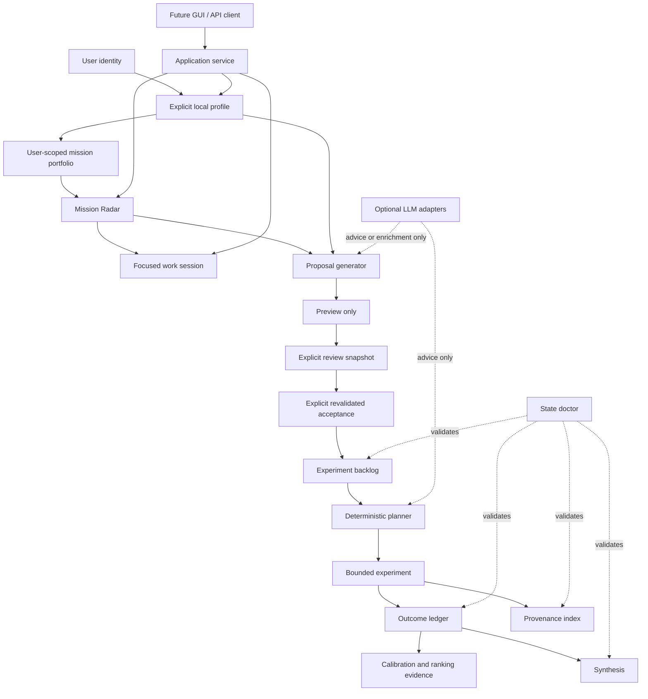

# Lumen Lab

> Local-first, auditable decision support for turning explicit priorities into ranked missions, focused work, reviewable experiments, and reusable evidence.

Lumen Lab is a Python system for structured self-directed work and R&D. It keeps the parts that should be predictable — identity, state, ranking, validation, safety gates, experiment history, and integrity checks — deterministic and inspectable. Optional LLMs can advise or enrich proposals, but they are not the source of truth and never receive automatic execution authority.

The project has two deliberately separate layers:

- the **user product**, where each person gets an isolated local workspace under `.lumen/users/<user-id>/`;
- the **repository laboratory**, where `state/` records Lumen's own experiments, outcomes, calibration evidence, provenance, and journal.

Installing Lumen must never make a new user inherit the repository owner's profile, missions, or work history.

## What Lumen is — and what it is not

Lumen is not a trained model and not a hidden persona. Personalization comes from explicit local profile data, mission tags, deterministic ranking, and user-scoped state.

Lumen is also not an unrestricted autonomous agent. Generated ideas are reviewable data, not authority. State-changing operations are explicit. Subprocess execution is allowlisted. Optional model output is validated. GitHub operations are separate, auditable capabilities.

A useful mental model is:

```text
Lumen = deterministic control plane
      + explicit local user state
      + measured experiment loop
      + optional bounded adapters
```

The control plane remains useful with no API key, no model endpoint, and no network.

## Architecture



The key trust boundary is **generation versus authority**. A deterministic generator or LLM may suggest a proposal, but a proposal is not an accepted experiment and an accepted experiment is not automatic execution.

## Quick start

Requirements: Python 3.11+.

```bash
python -m venv .venv
```

Activate the environment:

```powershell
# Windows PowerShell
.\.venv\Scripts\Activate.ps1
```

```bash
# Linux / macOS
source .venv/bin/activate
```

Install Lumen and development tooling:

```bash
python -m pip install -e ".[dev]"
```

Create an isolated local user:

```powershell
lumen-user --user alex init --name "Alex" --priority career=10 --priority health=7 --interest robotics --skill Python --constraint "5 hours per week"
```

Then use the same identity across the product commands:

```powershell
lumen-radar --user alex --top 3
lumen-work --user alex
lumen-work --user alex --done 1
lumen-propose --user alex
lumen-dashboard --user alex
```

Instead of repeating `--user`, set `LUMEN_USER_ID=alex`. If neither `--user` nor `LUMEN_USER_ID` is set, interactive commands resolve the local identity `default` and require that workspace to be initialized.

For repository development, verify both code and state:

```powershell
pytest
lumen-doctor
```

## The user product loop

For a real user, the normal flow is:

```text
explicit inputs
    ↓
local profile
    ↓
mission portfolio
    ↓
Mission Radar
    ↓
focused work session
    ↓
local progress

profile + mission evidence
    ↓
proposal preview
    ↓
explicit review
    ↓
explicit acceptance
    ↓
experiment / outcome evidence
```

The product never needs repository-owned `state/profile.json` to personalize a real user.

## Local user workspaces

Each user is isolated under:

```text
.lumen/users/<user-id>/
```

A mature workspace can contain:

```text
.lumen/users/alex/
├── profile.json
├── missions.json
├── work_sessions.json
├── work_progress.json
├── backlog.json
├── outcomes.json
└── journal.md
```

Only files that are actually needed are created. Onboarding creates the profile, starter missions, and matching work-session templates. Progress and experiment files appear as those flows are used.

The entire `.lumen/` runtime area is machine-local and ignored by Git by default. Cross-user fallback is not allowed: selecting `alice` never silently reads `bob` or repository-owned profile state.

See [Personalization](docs/personalization.md).

## Onboarding and identity

`lumen-user` is the explicit identity and onboarding boundary.

```powershell
lumen-user --user alex init --name "Alex" --priority ai=10 --priority career=9 --interest agents --skill Python --stack FastAPI --risk-tolerance 4
lumen-user --user alex show
lumen-user --user alex path
lumen-user list
```

User IDs are validated before they become filesystem paths, including path-traversal protection.

Onboarding is deterministic. It does not read hidden ChatGPT memory, account personalization, or repository-owner goals. Starter missions and work sessions are derived from the inputs supplied for that user.

## Mission Radar

`lumen-radar` ranks active missions using explicit mission inputs and optional profile alignment.

```powershell
lumen-radar --user alex
lumen-radar --user alex --top 3
lumen-radar --user alex --json
```

The base score is:

```text
base = 0.30 * impact
     + 0.20 * urgency
     + 0.25 * leverage
     + 0.15 * momentum
     + 0.10 * (11 - effort)
     - 0.15 * risk
```

When a profile is available:

```text
alignment = highest weighted profile priority matching a mission tag
            or neutral 5 when no tag matches

profile_adjustment = 0.30 * (alignment - 5)
risk_adjustment    = 0.10 * max(0, mission_risk - profile_risk_tolerance)

personalized_score = clamp(base + profile_adjustment - risk_adjustment, 0, 10)
```

The JSON output keeps `base_score` and personalized `score` separate, so personalization remains inspectable.

Reading the radar is non-mutating. It recommends work; it does not execute it.

See [Mission Radar](docs/mission-radar.md).

## Focused work sessions

`lumen-work` turns a selected mission into a bounded session with ordered steps and a Definition of Done.

```powershell
lumen-work --user alex
lumen-work --user alex --json
lumen-work --user alex --done 2
```

Reading a session is write-free. `--done <step>` is an explicit progress write and changes only the selected user's local workspace.

Lumen does not perform the listed steps on the user's behalf.

See [Work sessions](docs/work-sessions.md).

## Reviewable proposals

`lumen-propose` turns profile and mission evidence into candidate experiments without automatically executing or accepting them.

The lifecycle is intentionally multi-step:

```text
profile + missions + evidence
          ↓
      generate
          ↓
       preview          no state mutation
          ↓
 explicit review file   deliberate write
          ↓
 explicit acceptance    revalidation
          ↓
 normal experiment backlog
```

Normal interactive use is user-scoped:

```powershell
lumen-propose --user alex
lumen-propose --user alex --json
```

The default deterministic path requires no model and no network. A profile can opt into OpenAI-compatible enrichment, but model output is constrained by the same proposal schema, evidence references, duplicate guards, risk tolerance, and candidate limit.

There is intentionally no single operation where a fresh model response can generate and immediately accept itself.

Supplying a repository root explicitly without a user remains a developer/test path for maintaining Lumen's own lab state.

See [Proposal generation](docs/proposals.md).

## Application service and GUI boundary

The project is CLI-first today, but the GUI contract is already explicit. `LumenApplication` is the presentation-facing facade, so a future desktop or web client does not reimplement identity resolution, onboarding, ranking, progress updates, or recommendation explanations.

A client starts with:

```python
from pathlib import Path
from lumen_lab.app_service import LumenApplication

app = LumenApplication(Path.cwd())
payload = app.bootstrap("alex")
```

The versioned bootstrap payload includes:

- `schema_version`;
- `selected_user_id`;
- `initialized`;
- known initialized local users for switching;
- the selected user's dashboard when initialized.

That gives a client one deterministic route decision: onboarding if `initialized` is false, dashboard otherwise.

The application service also exposes onboarding, dashboard rendering, and progress completion. The GUI should call this service instead of reading `.lumen/` directly.

A temporary CLI bridge exposes the same dashboard data:

```powershell
lumen-dashboard --user alex
lumen-dashboard --user alex --json
lumen-dashboard --user alex --done 1 --json
```

See [Application service](docs/application-service.md).

## Repository laboratory

The repository itself is also a controlled R&D loop for improving Lumen. Its state lives in `state/` and is intentionally separate from real users.

Core lifecycle:

```text
backlog → active → done
               ↘ dropped
```

Each experiment stores a hypothesis and five dimensions from 1 to 10:

- impact;
- learning;
- feasibility;
- novelty;
- risk.

Priority is deterministic:

```text
experiment_score = 0.35 * impact
                 + 0.30 * learning
                 + 0.20 * feasibility
                 + 0.15 * novelty
                 - 0.25 * risk
```

Useful commands:

```powershell
lumen status
lumen next
lumen ledger
```

The internal deterministic backlog is currently complete; `state/backlog.json` remains the audit trail for the experiments that built the current system.

## Outcomes and calibration

Completed experiments record expected score, observed value, learning value, and a result summary in `state/outcomes.json`.

Lumen deliberately separates several questions:

```powershell
lumen-calibrate
lumen-rankcheck
lumen-intercept
lumen-holdout
```

- `lumen-calibrate` checks absolute prediction residuals;
- `lumen-rankcheck` evaluates relative ordering quality;
- `lumen-intercept` evaluates an advisory global score offset without changing ranking weights;
- `lumen-holdout` evaluates later outcomes against the frozen calibration baseline without refitting it.

Live evidence should be read from the repository state rather than copied into README numbers that will go stale.

See [Calibration](docs/calibration.md), [Ranking](docs/ranking.md), [Intercept calibration](docs/intercept_calibration.md), and [Frozen holdout](docs/frozen_calibration_holdout.md).

## Synthesis and provenance

`state/journal.md` is the append-only narrative history of the lab. `state/SYNTHESIS.md` is a deterministic derived view over structured state and journal metadata.

```powershell
lumen-synthesize
lumen-synthesize --write
```

Synthesis is not model-generated semantic truth. Its signals are intentionally inspectable and reproducible.

`state/provenance.json` links completed experiments to primary repository artifacts:

```powershell
lumen-provenance
lumen-provenance --experiment exp-019
lumen-provenance --json
```

See [Synthesis](docs/synthesis.md) and [Provenance](docs/provenance.md).

## State integrity and schema evolution

Autonomous work becomes unsafe when state files silently disagree. `lumen-doctor` is a read-only cross-file integrity checker.

```powershell
lumen-doctor
```

It validates experiment/outcome lifecycle links, candidate registry state, calibration baseline membership, holdout evaluation, provenance completeness, synthesis freshness, and schema compatibility.

The doctor detects problems; it does not repair them automatically.

Persisted repository state also has explicit schema metadata:

```powershell
lumen-schema
lumen-schema --json
```

Migration is explicit and fail-closed. The current legacy migration creates only schema metadata after validating managed files; it does not silently rewrite payloads.

See [State doctor](docs/state-doctor.md) and [State schema versioning](docs/state-schema-versioning.md).

## Backlog replenishment

The curated repository-owned candidate path remains available:

```powershell
lumen replenish
lumen replenish --apply
```

It is dry-run by default, refuses to replenish while pending work exists, validates normal experiment schemas, and never overwrites an existing experiment ID.

This is distinct from `lumen-propose`: replenishment uses `state/candidates.json`, while proposal generation adapts ideas to explicit profile and mission evidence and requires review.

See [Replenishment](docs/replenishment.md) and [Candidate registry](docs/candidate_registry.md).

## Optional planner advice

The deterministic planner remains authoritative. `lumen advise` can optionally ask an OpenAI-compatible model to recommend among existing backlog IDs.

A model response is validated against the real backlog and failures fall back to deterministic planning. The model cannot create an authoritative experiment simply by naming one.

See [LLM planner](docs/llm-planner.md).

## Controlled subprocess experiments

Lumen can run explicitly allowed commands in a constrained temporary workspace through `lumen sandbox`.

```powershell
lumen sandbox --allow python --timeout 2 --max-output-bytes 4096 --json -- python -c "print('hello')"
```

Named policies are available through:

```powershell
lumen-capabilities list
```

The runner uses `shell=False`, bare-executable allowlists, a fresh temporary directory, a minimal environment, disabled stdin, timeouts, and bounded captured output.

This is **process containment, not an OS security sandbox**. An allowed process still has the operating-system permissions of the current user and can potentially access absolute paths, use the network, consume resources, or spawn descendants. Hostile code requires a real container, VM, or OS-enforced sandbox.

See [Sandbox](docs/sandbox.md) and [Capability manifests](docs/capabilities.md).

## GitHub integration and branch hygiene

Repository experiments can be mirrored to GitHub Issues with explicit ownership markers. The bridge is dry-run first and does not modify unmanaged issues.

See [GitHub Issues bridge](docs/github-issues-bridge.md).

Merged development branches are cleaned by a conservative repository workflow. It preserves `main`, protected branches, open-PR heads, and unrelated work in progress, and removes only merged or explicitly superseded same-repository branches. This keeps the repository readable without broad branch deletion rules.

## CLI reference

The installed console entry points are:

| Command | Purpose |
| --- | --- |
| `lumen` | Repository lab status, planning, lifecycle, replenishment, sandbox, and optional advice. |
| `lumen-user` | Create, inspect, list, and resolve isolated local user workspaces. |
| `lumen-radar` | Rank the selected user's active missions. |
| `lumen-work` | Render a focused work session and explicitly record progress. |
| `lumen-propose` | Generate, review, and accept bounded experiment proposals. |
| `lumen-dashboard` | Render the application-service dashboard as human or JSON output. |
| `lumen-calibrate` | Inspect planner residual calibration. |
| `lumen-rankcheck` | Inspect pairwise experiment ranking quality. |
| `lumen-intercept` | Evaluate an advisory additive calibration intercept. |
| `lumen-holdout` | Evaluate the frozen calibration baseline on later outcomes. |
| `lumen-synthesize` | Preview or write deterministic synthesis. |
| `lumen-capabilities` | Audit or run named sandbox capability manifests. |
| `lumen-doctor` | Validate repository state integrity without repair. |
| `lumen-provenance` | Inspect completed-experiment evidence links. |
| `lumen-schema` | Inspect or explicitly migrate repository state schema metadata. |

All commands are declared in `pyproject.toml`; CI includes a README contract test so this table cannot silently drift away from the installed entry points.

## Repository map

```text
lumen-lab/
├── .github/workflows/        CI and repository automation
├── docs/                     architecture, contracts, trust boundaries
├── src/lumen_lab/            product and lab implementation
├── state/                    repository-owned R&D evidence
├── tests/                    executable behavior contracts
└── .lumen/users/             ignored machine-local user state at runtime
```

Important boundaries:

- `src/lumen_lab/workspace.py` — identity resolution and isolated user paths;
- `src/lumen_lab/personalization.py` — deterministic onboarding into starter missions and work sessions;
- `src/lumen_lab/app_service.py` — stable application-facing boundary for GUI/API clients;
- `state/` — Lumen's own repository experiment evidence, not universal user data;
- `.lumen/users/` — local personal state, ignored by Git;
- `tests/` — behavior and safety contracts, including cross-user isolation.

## Safety and privacy principles

1. **Explicit user boundary.** No cross-user profile or progress fallback.
2. **Local personal state.** User workspaces are ignored by Git by default.
3. **No hidden personalization dependency.** Core behavior does not require ChatGPT memory or account metadata.
4. **Deterministic authority.** Optional model output is validated and remains advisory or review-gated.
5. **Explicit mutation.** Reading and ranking should not mutate state; writes require deliberate commands.
6. **No exaggerated sandbox claims.** Process containment is documented as weaker than OS isolation.
7. **Evidence before automation.** Outcomes, provenance, tests, and journal history remain inspectable.
8. **No mandatory secrets.** Normal CI and deterministic product flows require no external credentials.

## Development and CI

Run locally:

```powershell
python -m pip install -e ".[dev]"
ruff check .
pytest
lumen-doctor
```

GitHub Actions runs the test/lint matrix on Python 3.11, 3.12, and 3.13. Changes should not merge with failing CI.

Tests cover the deterministic planner, personalization, cross-user isolation, mission ranking, work progress, proposal trust boundaries, calibration, provenance, schema health, branch hygiene, and application-service contracts.

## Deeper documentation

- [Personalization](docs/personalization.md)
- [Application service](docs/application-service.md)
- [Profiles](docs/profiles.md)
- [Mission Radar](docs/mission-radar.md)
- [Work sessions](docs/work-sessions.md)
- [Proposal generation](docs/proposals.md)
- [Calibration](docs/calibration.md)
- [Ranking](docs/ranking.md)
- [Intercept calibration](docs/intercept_calibration.md)
- [Frozen holdout](docs/frozen_calibration_holdout.md)
- [Synthesis](docs/synthesis.md)
- [Provenance](docs/provenance.md)
- [State doctor](docs/state-doctor.md)
- [State schema versioning](docs/state-schema-versioning.md)
- [Replenishment](docs/replenishment.md)
- [Candidate registry](docs/candidate_registry.md)
- [LLM planner](docs/llm-planner.md)
- [Sandbox](docs/sandbox.md)
- [Capability manifests](docs/capabilities.md)
- [GitHub Issues bridge](docs/github-issues-bridge.md)

## Direction

The core user boundary is now stable enough for a real application layer:

```text
user_id → profile → missions → work session → feedback
```

`LumenApplication` already exposes onboarding, bootstrap, dashboard, explainability, and progress updates behind that boundary. The next UI should remain a thin presentation client over those contracts rather than inventing a second personalization or state model.

The engineering goal is not maximum autonomy. It is useful, auditable assistance where every increase in capability preserves an explicit trust boundary.